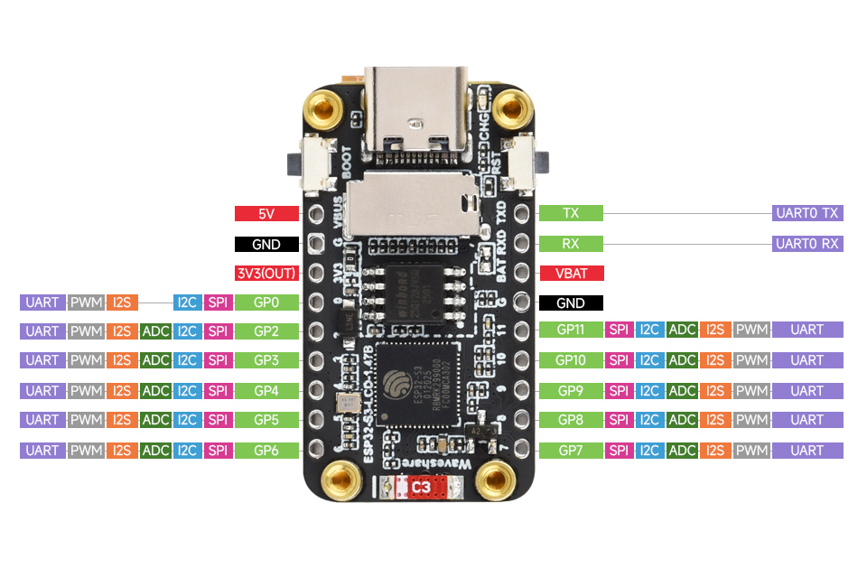

# <div align="center">Jcorp Nomad USB C Variant</div>

<div align="center">
  
</div>

<p align="center"><b>A portable, offline media server powered by the ESP32-S3 in a thumbdrive form factor.</b><br>
Stream movies, music, books, and shows anywhere — no internet required.</p>

<p align="center">
  
  
  
</p>

---

> [!NOTE]
> WYSIWYG 
> I've done my best to document my changes to the orginal to get it working on the Waveshare ESP32-S3-LCD-1.47B (USB C).
> I had to change a pin in the [firmware/JcorpNomadProject/Display_ST7789.h](firmware/JcorpNomadProject/Display_ST7789.h) to get the screen working. 

> [!TIP]
> Cannot stress enough that you need a proper cable and power supply, PC/laptop may not give you the amps needed to run the screen in addition to the server.

> [!CAUTION]
> The ESP32S3 Chip gets quite hot while in operation. 

## Quick Start

1. Flash the ESP32-S3 with the firmware in the `/firmware/` and utilize `/libraries/` directories using Arduino IDE.
    - Tapping Boot and then RST twice usually gets it ready for flashing if you're uploading code again.
        - This may change your COM port moments before uploading the code
    - Arduino Board Flash Settings under Tools menu:
        - Board: ESP32S3 Dev Module
        - USB CDC On Boot: "Enabled"
        - Erase All Flash Before Sketch Upload: "Enabled"
        - Flash Size: "16MB (128Mb)
        - Partition Scheme: "16M (3MB APP/9.9MB FATFS)"
        - PSRAM: "OPI PSRAM"
        - Upload Speed: "921600"
        - USB Mode: "USB-OTG (TinyUSB)"
2. Separately format your SD card as **FAT32**, Allocation size: **32K**, name it whatever. [GUIFormat Tool](https://fat32format-gui.en.lo4d.com/windows) is useful for proper allocation size.
3. Copy the files from `/SD_Card_Template/` and place your media files into the appropriate folders, [see structure below](#WIP-Status).
4. Insert the SD card and power on the device.
5. Connect to the Wi-Fi network named `NomadServer` (unless you changed it) the default password may be `password`.
6. Your browser will be redirected to the offline media interface.
    - you may need to generate the media.json once you're in, there is a button, or you have to change the setting and reboot until it populates.

## File Compatibility & Streaming

A compatibility guide for supported media types, streaming expectations, and additional notes on performance.

| Category      | Supported Formats                    | Notes                                                                                   |
|---------------|------------------------------------|-----------------------------------------------------------------------------------------|
| **Video**     | `.mp4`, `.mov`, `.mkv`, `.webm`   | Reliable playback for these formats. `.avi` and `.flv` are **not supported**. Encoding video files using **H.264** video codec and **AAC** audio codec tends to improve streaming performance and allow more concurrent streams.  1080P = 2-3 streams, lower quality = more streams.        |
| **Audio**     | `.mp3`, `.flac`, `.wav`             | Other audio formats are **not supported** by the built-in player.                       |
| **Books / Docs** | `.pdf` (recommended), `.epub` (download only) | `.pdf` files can be opened and read directly in the browser. `.epub` files are downloadable but cannot be viewed in the built-in reader. |
| **Images**     | `.jpg`             | Used for covers and folder images only, and ensure all images and media files use matching names for proper display.                       |


> [!Warning]
> By utilizing FAT32 storage we limit individual file sizes to under 4 GB.

## Example Folder Structure (on SD Card)

```
/Movies/
    Movie.mp4
    Movie.jpg
/Shows/
    Show Name/
        S01E01 - Episode 1 Title.mp4
        S01E02 - Episode 2 Title.mp4
    Show Name.jpg
/Books/
    Book Title.pdf
    Book Title.jpg
/Music/
    track01.mp3

index.html
appleindex.html
menu.html
movies.html
shows.html
books.html
music.html
media.json
placeholder.jpg
Logo.png
favicon.ico
```
 
> [!TIP]
> I am not the original dev, best to go to the original[JCorp Nomad repository](https://github.com/Jstudner/jcorp-nomad/issues) or the [Waveshare ESP32-S3-LCD-1.47B wiki](https://www.waveshare.com/wiki/ESP32-S3-LCD-1.47B) first.

## Troubleshooting

| Issue | Symptoms | Cause | Fix |
|-------|----------|-------|-----|
| **SD Card Errors** | Crashes after connect, random reboots, read errors, SD LED off | Not FAT32, bad/cheap card, overheating | Format FAT32 ([tool](https://fat32format.com)), check serial logs, test card, thermal pad may help, unplug/replug if looped |
| **Wi-Fi Issues** | No redirect, blank screen, “no wifi”, WiFi LED off | Captive portal quirks, missing HTML files, device-specific bugs | Check serial (`WiFi Online`), ensure `index.html` + `appleindex.html`, tweak firmware for certain phones |
| **Video Seek Fails** | Video plays but can’t skip, hangs/reloads | ESP32 poor at handling byte range requests | Check serial logs, reincode videos, if controls break = other issue, still WIP. |
| **Screen Glitches** | Screen off, distorted/vanishing UI | Damaged screen, corrupted GUI export | Check firmware/connection (LED on), **check USB Power Supply**, re-export GUI , replace if cracked |

## Repo Structure

- [/firmware](/firmware) – Literally just Arduino (see .ino file) firmware for ESP32-S3, I will probably spin this into the ardiuno folder as a sketch at some point, for now it's nice to have so I can see deltas between repos.
    - [/firmware/JcorpNomadProject/JcorpNomadProject.ino](/firmware/JcorpNomadProject/JcorpNomadProject.ino) - Wi-Fi name and password can be changed here
- [/SD_Card_Template](/SD_Card_Template/) – Web UI, HTML files, and [/SD_Card_Template/media.json](/SD_Card_Template/media.json). 
    - [/SD_Card_Template/menu.html](/SD_Card_Template/menu.html) - Branding (logo, favicon) can be replaced in here. Sections (Movies, Music, etc.) can be removed from here.
- [/Arduino/libraries/](/Arduino/libraries/) – arduino libraries I needed to get this off the ground. This was a zip as a release on main branch. 

## WIP Status

- [x] Get working on Waveshare ESP32-S3-LCD-1.47B (USB C)
    - [x] [https://www.waveshare.com/wiki/ESP32-S3-LCD-1.47B](https://www.waveshare.com/wiki/ESP32-S3-LCD-1.47B)
- [ ] Learn how to change screen UI
- [x] Update Trim down this bloated readme from original, it's quite messy.
    - [x] Add clearer instructions for when I decide to do this again.
        - [x] [Troubleshooting](#Troubleshooting) should just be here, no need for [instructables](https://www.instructables.com/Jcorp-Nomad-Mini-WIFI-Media-Server/) .
        - [x] quickstart lacking information (fat32 specs)
    - [x] remove updates/promos and condense to necessary information.   
    - [x] Add arduino libraries as directory rather than zip file in release.
- [ ] Possibly attempt to update libraries (if feasible) 
    - [ ] Double check on libraries since experimental merge .zip, available here for you [/Arduino/libraries/](/Arduino/libraries/):
         - [x] "ArduinoJson" by Benoit Blanchon v7.3.0
         - [ ] "Async TCP" by ESP32Async v3.4.7, here 3.3.5 installed
         - [x] "ESP Async Webserver" by ESP32Async v3.7.1
         - [ ] "LVGL" by kisvegabor v8.4.0, here 8.3.10 installed
- [ ] Large directories (80+ GB) can cause the admin file browser to crash when opened.  
- [ ] Some bugs remain with SD Card storage reading on both the Screen UI and the admin panel.
- [ ] Heat dissipation options? 
- [ ] Try this on a simpler board without a screen. Could make it a bit more rugged.